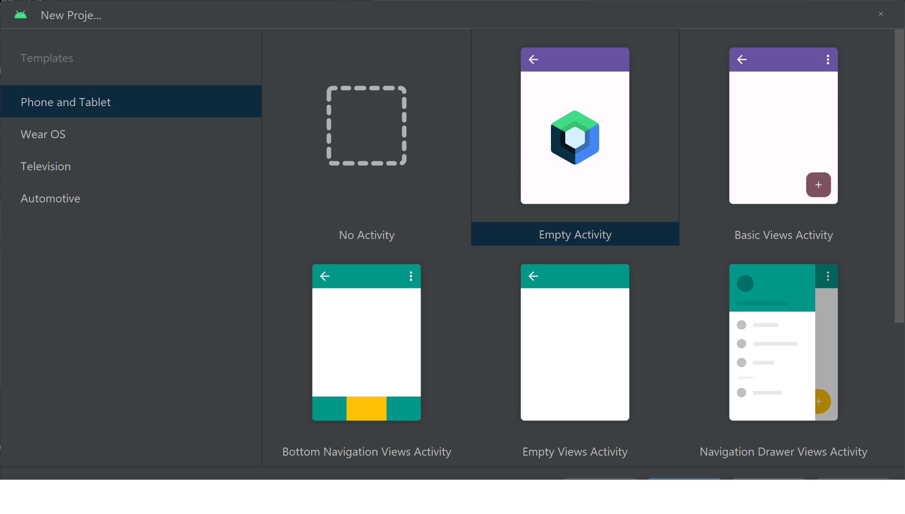
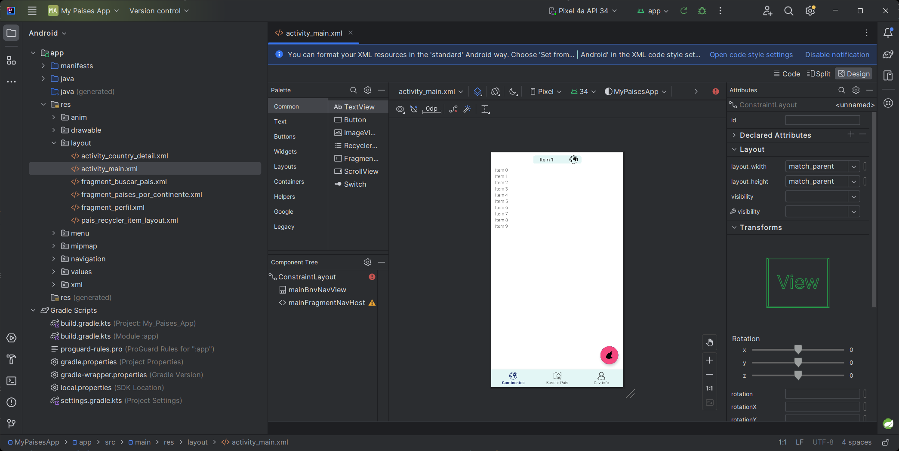

# Definición de estructura de proyecto

En esta sección hablaremos de la estructura de proyecto a seguir y la cración de recursos a utilizar

## Videos
> [S2 - Creación de proyecto](https://1drv.ms/u/s!AvB-2ztiY9QqgpR2x8_KxgOAC1dPsQ?e=WNHLmR)
[](https://1drv.ms/u/s!AvB-2ztiY9QqgpR2x8_KxgOAC1dPsQ?e=WNHLmR "Creación de proycto")

> [S2 - Creación de recursos, activities y fragments](https://1drv.ms/u/s!AvB-2ztiY9QqgpR3A4BcujabUB33mw?e=OLgU2U)
[](https://1drv.ms/u/s!AvB-2ztiY9QqgpR3A4BcujabUB33mw?e=OLgU2U "Creación de proycto")


## Dependencias necesarias para trabajar

### Librearía para el consumo de servicios web (APIs) [Retrofit](https://square.github.io/retrofit/)


```c
    // Para Retrofit
    implementation("com.squareup.retrofit2:retrofit:2.9.0")
    implementation("com.squareup.retrofit2:adapter-rxjava2:2.9.0")
    implementation("com.squareup.retrofit2:converter-gson:2.9.0")
```

### Librería pára optimización de hilos [RxJava](https://github.com/ReactiveX/RxJava)

```c
    // Para RXJava
    implementation("io.reactivex.rxjava2:rxandroid:2.0.1")
    implementation("io.reactivex.rxjava2:rxjava:2.1.7")
```

### Librería [Glide](https://github.com/bumptech/glide) para carga de imágenes

```c
    // Para manejo de imágenes contenidas en servidor
    implementation("com.github.bumptech.glide:glide:4.16.0")
```

## Assets del proyecto

* Utilizados para este proyecto [aquí](./assets/)
* Si quieres buscar y utilizar tus propios recursos utiliza la web de [SVG Repo](https://www.svgrepo.com/)