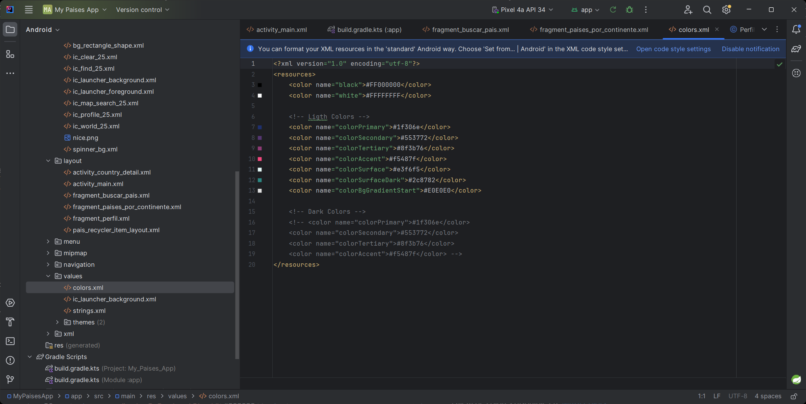
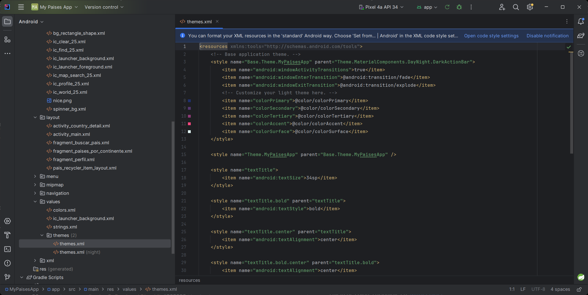
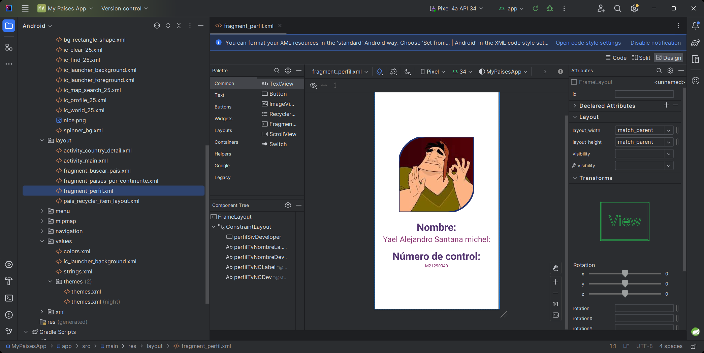
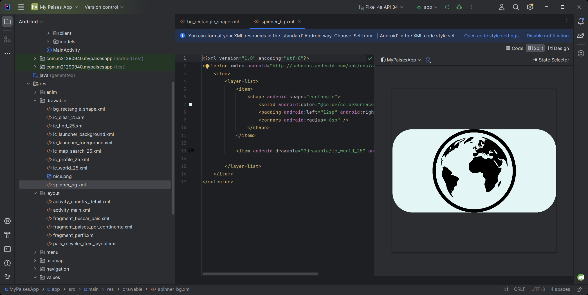
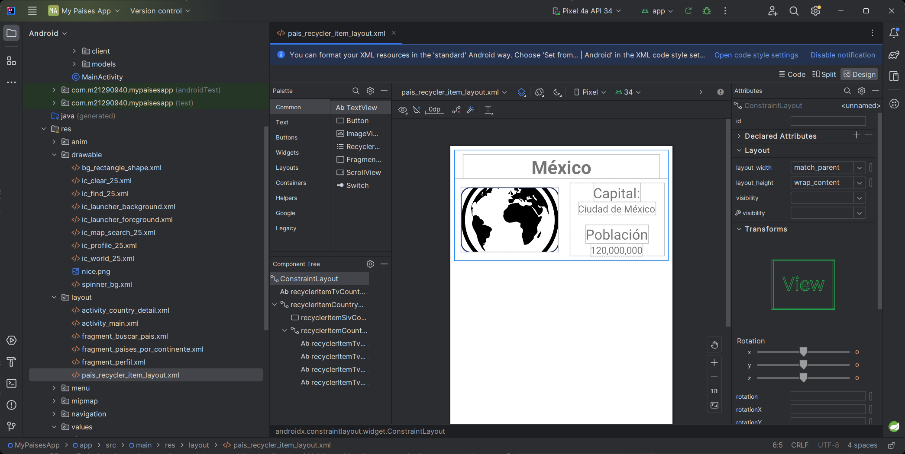
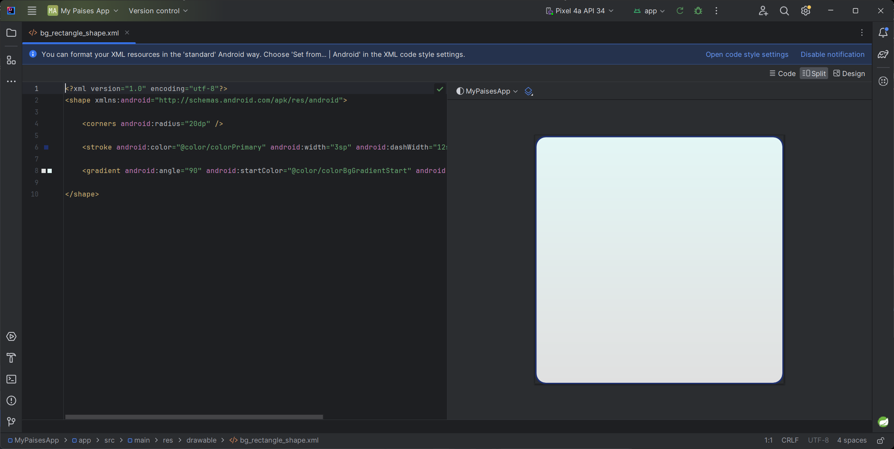

# Diseño de interfaz grafica de la aplicación

En esta sección solo deberán recrear los diseños

## Videos
> [S3 - Personalización de temas](https://1drv.ms/u/s!AvB-2ztiY9QqgpR2x8_KxgOAC1dPsQ?e=WNHLmR)
[](https://1drv.ms/u/s!AvB-2ztiY9QqgpR2x8_KxgOAC1dPsQ?e=WNHLmR "Creación de proycto")

> [S3 - Creación de estilos para implementar en un futuro](https://1drv.ms/u/s!AvB-2ztiY9QqgpR3A4BcujabUB33mw?e=OLgU2U)
[](https://1drv.ms/u/s!AvB-2ztiY9QqgpR3A4BcujabUB33mw?e=OLgU2U "Creación de proycto")

> [S3 - Implementando los estilos](https://1drv.ms/u/s!AvB-2ztiY9QqgpR3A4BcujabUB33mw?e=OLgU2U)
[](https://1drv.ms/u/s!AvB-2ztiY9QqgpR3A4BcujabUB33mw?e=OLgU2U "Creación de proycto")

> [S3 - Personalizando el view Spinner](https://1drv.ms/u/s!AvB-2ztiY9QqgpR3A4BcujabUB33mw?e=OLgU2U)
[](https://1drv.ms/u/s!AvB-2ztiY9QqgpR3A4BcujabUB33mw?e=OLgU2U "Creación de proycto")

> [S3 - Creando layout personalizado para RecyclerView](https://1drv.ms/u/s!AvB-2ztiY9QqgpR3A4BcujabUB33mw?e=OLgU2U)
[](https://1drv.ms/u/s!AvB-2ztiY9QqgpR3A4BcujabUB33mw?e=OLgU2U "Creación de proycto")

> [S3 - Dando estilo de tarjeta al layout](https://1drv.ms/u/s!AvB-2ztiY9QqgpR3A4BcujabUB33mw?e=OLgU2U)
[](https://1drv.ms/u/s!AvB-2ztiY9QqgpR3A4BcujabUB33mw?e=OLgU2U "Creación de proycto")

## Colores utilizados

Paleta de colores dispnible en: [Muzli Colors](https://colors.muz.li/palette/272643/ffffff/e3f6f5/bae8e8/c5deed)

```xml
<color name="colorPrimary">#1f306e</color>
<color name="colorSecondary">#553772</color>
<color name="colorTertiary">#8f3b76</color>
<color name="colorAccent">#f5487f</color>
<color name="colorSurface">#e3f6f5</color>
<color name="colorSurfaceDark">#2c8782</color>
<color name="colorBgGradientStart">#E0E0E0</color>
```

## Diseños de interfaz

Para ver los diseños que tienen que ser recreados abre el archivo ["Diseños de interfaz gráfica para aplicación My Country App.pdf"](./Diseños%20de%20interfaz%20gráfica%20para%20aplicación%20My%20Country%20App.pdf) incluido en esta carpeta

## Librerías para complementar el diseño

Las siguientes librerias son necesarias para la correcta definición del elemento "fragment" en el activity_main, sin estas no funcionarán

```c
    // Dependencias para la navegación
    implementation("androidx.navigation:navigation-fragment:2.7.5")
    implementation("androidx.navigation:navigation-ui:2.7.5")
```