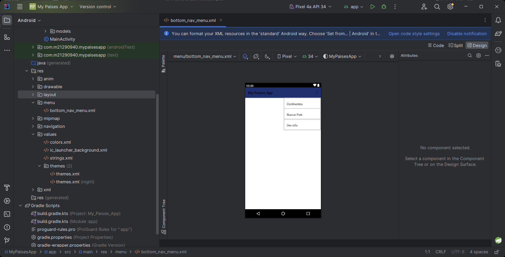
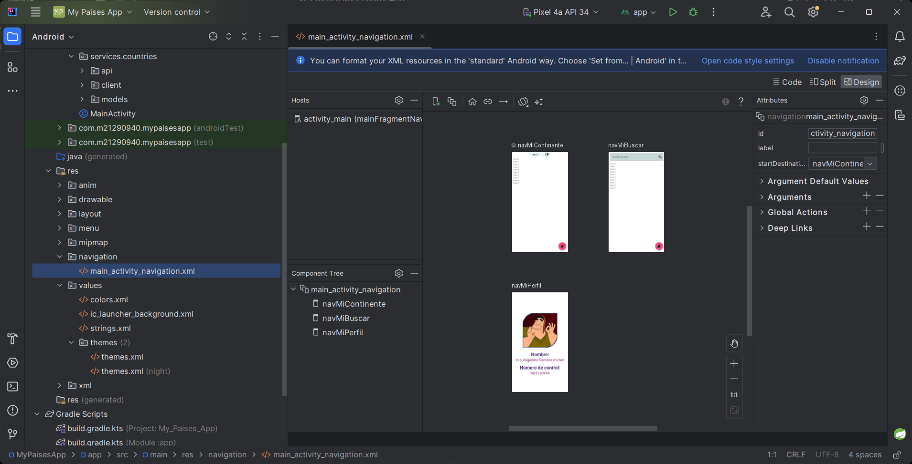
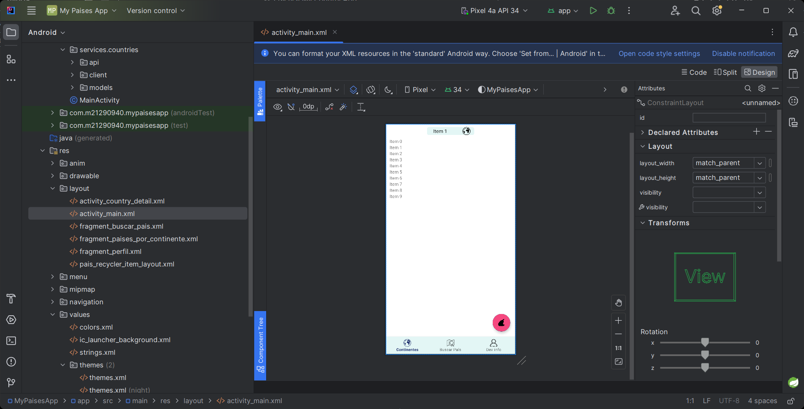

# Navegación a través del elemento BottomNavigationview

En esta sección habilitaremos la navegación a través del elemento mencionado

## Videos
> [S4 - Creación del menu para navegación](https://1drv.ms/u/s!AvB-2ztiY9QqgpUNPkxvSzbCHPgZCw?e=uhYuK7)
[](https://1drv.ms/u/s!AvB-2ztiY9QqgpUNPkxvSzbCHPgZCw?e=uhYuK7 "Creación de proycto")

> [S4 - Creando componente de mavegación](https://1drv.ms/u/s!AvB-2ztiY9QqgpUO8KQvQZLrN3Mn3Q?e=93g2dO)
[](https://1drv.ms/u/s!AvB-2ztiY9QqgpUO8KQvQZLrN3Mn3Q?e=93g2dO "Creación de proycto")

> [S4 - Haciendo funcionar la navegación](https://1drv.ms/u/s!AvB-2ztiY9QqgpUPtxOGXBLAJ_eW8A?e=cVnSeA)
[](https://1drv.ms/u/s!AvB-2ztiY9QqgpUPtxOGXBLAJ_eW8A?e=cVnSeA "Haciendo funcionar la navegación")

## Menu items
Estos son los menu items que tienen que crear para la navegación
```xml
     <item
        android:id="@+id/mainNavMiContinente"
        android:icon="@drawable/ic_world_25"
        android:title="@string/mainNavMiContinente"
        android:enabled="true"
        />

    <item
        android:id="@+id/mainNavMiBuscar"
        android:icon="@drawable/ic_map_search_25"
        android:title="@string/mainNavMiBuscar"
        android:enabled="true"
        />

    <item
        android:id="@+id/mainNavMiPerfil"
        android:icon="@drawable/ic_profile_25"
        android:title="@string/mainNavMiPerfil"
        android:enabled="true"
        />
```

## Definición de elementos activos para la navegación
Estos son los elementos que deberán tener en el atchivo de "main_navigation_component.xml"
```xml
    <fragment
        android:id="@+id/mainNavMiContinente"
        android:name="com.m21290940.mycountryapp.paises.fragments.PorContinenteFragment"
        android:label="Paises por continente"
        tools:layout="@layout/fragment_por_continente" />

    <fragment
        android:id="@+id/mainNavMiBuscar"
        android:name="com.m21290940.mycountryapp.paises.fragments.BuscarPaisesFragment"
        android:label="Buscar País Por Nombre"
        tools:layout="@layout/fragment_buscar_paises" />

    <fragment
        android:id="@+id/mainNavMiPerfil"
        android:name="com.m21290940.mycountryapp.perfil.fragments.PerfilFragment"
        android:label="Desarrollador"
        tools:layout="@layout/fragment_perfil" />
```