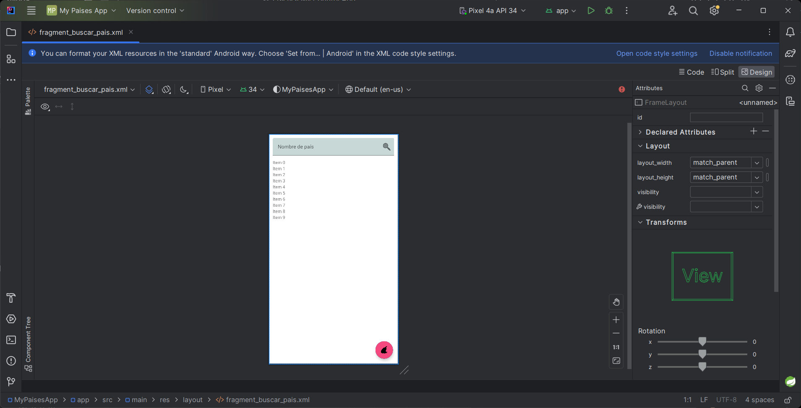

# Dando funcionalidad básica a los fragmentos

Dicha funcionalidad básica es que puedan mostrar algunos datos

## ContinenteFragment
* Mostrar en un Spinner los nombres de los continentes
* Seleccionar algún elemento del spinner y obtener su valor
### Video
> [S5 - ContinenteFragment](https://itcgedu-my.sharepoint.com/:v:/g/personal/m21290940_cdguzman_tecnm_mx/ERy4er12nPFOslpIws38O6kBFx38aEWRag6su76slhYj_w?nav=eyJyZWZlcnJhbEluZm8iOnsicmVmZXJyYWxBcHAiOiJPbmVEcml2ZUZvckJ1c2luZXNzIiwicmVmZXJyYWxBcHBQbGF0Zm9ybSI6IldlYiIsInJlZmVycmFsTW9kZSI6InZpZXciLCJyZWZlcnJhbFZpZXciOiJNeUZpbGVzTGlua0NvcHkifX0&e=Tmtis3)

## BuscarFragment
* Habilitar la búsqueda cuando se presione tecla "Enter" del teclado virtual
* Modificar el "EndIcon" del TIL y configurar funcionalidad personalizada del mismo

### Video
> [S5 - BuscarFragment](https://itcgedu-my.sharepoint.com/:v:/g/personal/m21290940_cdguzman_tecnm_mx/ESB_i0dNNF9Jqe2KwJO1TdwBGgbAXT3Flbx7wrEEmSVg4Q?nav=eyJyZWZlcnJhbEluZm8iOnsicmVmZXJyYWxBcHAiOiJPbmVEcml2ZUZvckJ1c2luZXNzIiwicmVmZXJyYWxBcHBQbGF0Zm9ybSI6IldlYiIsInJlZmVycmFsTW9kZSI6InZpZXciLCJyZWZlcnJhbFZpZXciOiJNeUZpbGVzTGlua0NvcHkifX0&e=yzsHa3)
