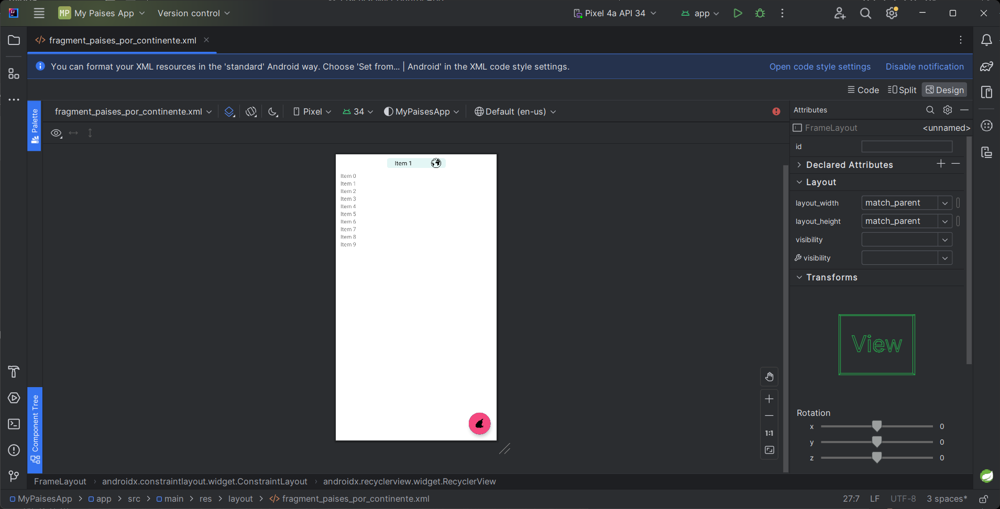

# Dando funcionalidad básica a los fragmentos

Dicha funcionalidad básica es que puedan mostrar algunos datos

## ContinenteFragment
* Mostrar en un Spinner los nombres de los continentes
* Seleccionar algún elemento del spinner y obtener su valor
### Video
> [S5 - ContinenteFragment](https://1drv.ms/v/s!AvB-2ztiY9QqgpUTg6i9EIqnwYZCVw?e=rwENuk)

## BuscarFragment
* Habilitar la búsqueda cuando se presione tecla "Enter" del teclado virtual
* Modificar el "EndIcon" del TIL y configurar funcionalidad personalizada del mismo

### Video
> [S5 - BuscarFragment](https://1drv.ms/u/s!AvB-2ztiY9QqgpUUP9g1Hty-Djq9Iw?e=urfDNw)
