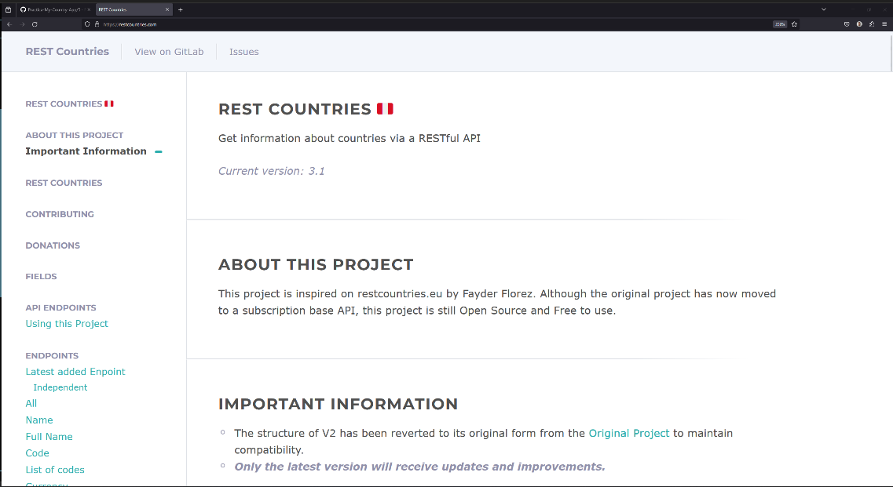
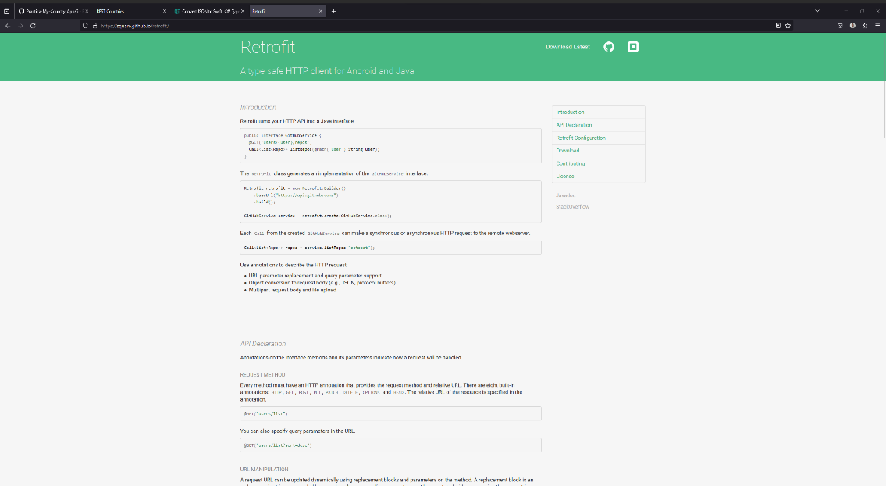
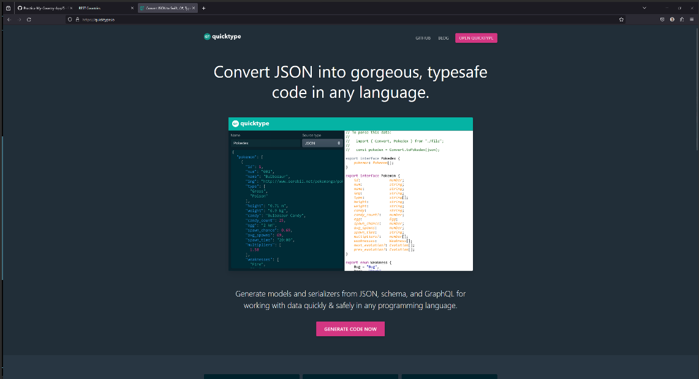
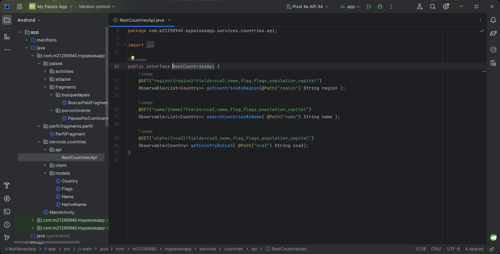
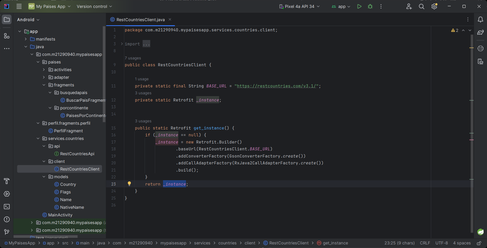

# Creando la representación de la API para la extracción de datos de un servidor

## Servicio a consumir

La Api a consumir será la api de [RestCountries](https://restcountries.com/) la cual es capaz de abastecer de información acerca de paises

### Video
> [S6 - Presentación de la API a consumir](https://itcgedu-my.sharepoint.com/:v:/g/personal/m21290940_cdguzman_tecnm_mx/EYaHCWgPcp1NucXOmm54oSIBw379UlIIxBJl9Bk0HpYTWw?nav=eyJyZWZlcnJhbEluZm8iOnsicmVmZXJyYWxBcHAiOiJPbmVEcml2ZUZvckJ1c2luZXNzIiwicmVmZXJyYWxBcHBQbGF0Zm9ybSI6IldlYiIsInJlZmVycmFsTW9kZSI6InZpZXciLCJyZWZlcnJhbFZpZXciOiJNeUZpbGVzTGlua0NvcHkifX0&e=ZqhXqi)
[](https://itcgedu-my.sharepoint.com/:v:/g/personal/m21290940_cdguzman_tecnm_mx/EYaHCWgPcp1NucXOmm54oSIBw379UlIIxBJl9Bk0HpYTWw?nav=eyJyZWZlcnJhbEluZm8iOnsicmVmZXJyYWxBcHAiOiJPbmVEcml2ZUZvckJ1c2luZXNzIiwicmVmZXJyYWxBcHBQbGF0Zm9ybSI6IldlYiIsInJlZmVycmFsTW9kZSI6InZpZXciLCJyZWZlcnJhbFZpZXciOiJNeUZpbGVzTGlua0NvcHkifX0&e=ZqhXqi "Presentación de la API a consumir")

## La librería [Retrofit](https://square.github.io/retrofit/)

Siempre que vayan a implementar una librería deben de asegurarse de leer la documentación oficial o por lo menos visitar o ver algún sitio o video acerca de la librería

### Video
> [S6 - Librería Retrofit](https://itcgedu-my.sharepoint.com/:v:/g/personal/m21290940_cdguzman_tecnm_mx/EbQ7pVGFrC9JojnGqT08kwwB6FBRa9amLYcz1qjBTK4aDA?nav=eyJyZWZlcnJhbEluZm8iOnsicmVmZXJyYWxBcHAiOiJPbmVEcml2ZUZvckJ1c2luZXNzIiwicmVmZXJyYWxBcHBQbGF0Zm9ybSI6IldlYiIsInJlZmVycmFsTW9kZSI6InZpZXciLCJyZWZlcnJhbFZpZXciOiJNeUZpbGVzTGlua0NvcHkifX0&e=kM77T5)
[](https://itcgedu-my.sharepoint.com/:v:/g/personal/m21290940_cdguzman_tecnm_mx/EbQ7pVGFrC9JojnGqT08kwwB6FBRa9amLYcz1qjBTK4aDA?nav=eyJyZWZlcnJhbEluZm8iOnsicmVmZXJyYWxBcHAiOiJPbmVEcml2ZUZvckJ1c2luZXNzIiwicmVmZXJyYWxBcHBQbGF0Zm9ybSI6IldlYiIsInJlZmVycmFsTW9kZSI6InZpZXciLCJyZWZlcnJhbFZpZXciOiJNeUZpbGVzTGlua0NvcHkifX0&e=kM77T5 "Librería Retrofit")

## Definición de Modelos

Para asegurar que ustedes tengan accesso a la de finición de modelos deberán de copiar el contenido del archivo ["countries.json"](./countries.json) que está en esta misma sección.

Además deberán de acceder a la páginade [Quicktype](https://quicktype.io/) para obtener el código de manera fácil

### Video
> [S6 - Creación de modelos](https://itcgedu-my.sharepoint.com/:v:/g/personal/m21290940_cdguzman_tecnm_mx/EY-SFcf8NJhHtWiBOI4DX2IBd862YDEumeGCabKJs7fkHQ?nav=eyJyZWZlcnJhbEluZm8iOnsicmVmZXJyYWxBcHAiOiJPbmVEcml2ZUZvckJ1c2luZXNzIiwicmVmZXJyYWxBcHBQbGF0Zm9ybSI6IldlYiIsInJlZmVycmFsTW9kZSI6InZpZXciLCJyZWZlcnJhbFZpZXciOiJNeUZpbGVzTGlua0NvcHkifX0&e=6f4uJK)
[](https://itcgedu-my.sharepoint.com/:v:/g/personal/m21290940_cdguzman_tecnm_mx/EY-SFcf8NJhHtWiBOI4DX2IBd862YDEumeGCabKJs7fkHQ?nav=eyJyZWZlcnJhbEluZm8iOnsicmVmZXJyYWxBcHAiOiJPbmVEcml2ZUZvckJ1c2luZXNzIiwicmVmZXJyYWxBcHBQbGF0Zm9ybSI6IldlYiIsInJlZmVycmFsTW9kZSI6InZpZXciLCJyZWZlcnJhbFZpZXciOiJNeUZpbGVzTGlua0NvcHkifX0&e=6f4uJK "Creación de modelos")


## Generando la interfaz para consumo de la API

Para poder invocar los métodos disponibles dentro de la API hay que generar una interfaz de que permita conectarse bajo las reglas de la API

Valor para los filtros:
```java
  "?fields=name,cca3,flag,flags,capital,population"
```

### Video
> [S6 - Definiendo interfaz API](https://itcgedu-my.sharepoint.com/:v:/g/personal/m21290940_cdguzman_tecnm_mx/EeuoWbxb3gZBtnrEBcC1aGUBv7vPt19MvyOXLMs4QMMvjw?nav=eyJyZWZlcnJhbEluZm8iOnsicmVmZXJyYWxBcHAiOiJPbmVEcml2ZUZvckJ1c2luZXNzIiwicmVmZXJyYWxBcHBQbGF0Zm9ybSI6IldlYiIsInJlZmVycmFsTW9kZSI6InZpZXciLCJyZWZlcnJhbFZpZXciOiJNeUZpbGVzTGlua0NvcHkifX0&e=xhddJs)
[](https://itcgedu-my.sharepoint.com/:v:/g/personal/m21290940_cdguzman_tecnm_mx/EeuoWbxb3gZBtnrEBcC1aGUBv7vPt19MvyOXLMs4QMMvjw?nav=eyJyZWZlcnJhbEluZm8iOnsicmVmZXJyYWxBcHAiOiJPbmVEcml2ZUZvckJ1c2luZXNzIiwicmVmZXJyYWxBcHBQbGF0Zm9ybSI6IldlYiIsInJlZmVycmFsTW9kZSI6InZpZXciLCJyZWZlcnJhbFZpZXciOiJNeUZpbGVzTGlua0NvcHkifX0&e=xhddJs "Definiendo interfaz API")


## Creación del Cliente

La forma de realizar la conexión con la API es a través de un cliente, dicho cliente es que implementará la interfaz creada para poder traer datos de la API

Valor del BASE_URL:
```java
    "https://restcountries.com/v3.1/"
```

### Video
> [S6 - Creando el cliente de la API](https://itcgedu-my.sharepoint.com/:v:/g/personal/m21290940_cdguzman_tecnm_mx/Ea68kP9GFTFAkE6wO_Pn8sgBL9mBIIRWoVEieErXRZLqvw?nav=eyJyZWZlcnJhbEluZm8iOnsicmVmZXJyYWxBcHAiOiJPbmVEcml2ZUZvckJ1c2luZXNzIiwicmVmZXJyYWxBcHBQbGF0Zm9ybSI6IldlYiIsInJlZmVycmFsTW9kZSI6InZpZXciLCJyZWZlcnJhbFZpZXciOiJNeUZpbGVzTGlua0NvcHkifX0&e=hj9jKM)
[](https://itcgedu-my.sharepoint.com/:v:/g/personal/m21290940_cdguzman_tecnm_mx/Ea68kP9GFTFAkE6wO_Pn8sgBL9mBIIRWoVEieErXRZLqvw?nav=eyJyZWZlcnJhbEluZm8iOnsicmVmZXJyYWxBcHAiOiJPbmVEcml2ZUZvckJ1c2luZXNzIiwicmVmZXJyYWxBcHBQbGF0Zm9ybSI6IldlYiIsInJlZmVycmFsTW9kZSI6InZpZXciLCJyZWZlcnJhbFZpZXciOiJNeUZpbGVzTGlua0NvcHkifX0&e=hj9jKM "Creando el cliente de la API")


## Complemento: Preparando la utilización de filtro "fields"

### Video
> [S6 - Preparando la variable de los filtros](https://itcgedu-my.sharepoint.com/:v:/g/personal/m21290940_cdguzman_tecnm_mx/EUcbOTmy5zVMv7J4J-cl3sgBX4FA47mA_Cq6QjeHXHMIZQ?nav=eyJyZWZlcnJhbEluZm8iOnsicmVmZXJyYWxBcHAiOiJPbmVEcml2ZUZvckJ1c2luZXNzIiwicmVmZXJyYWxBcHBQbGF0Zm9ybSI6IldlYiIsInJlZmVycmFsTW9kZSI6InZpZXciLCJyZWZlcnJhbFZpZXciOiJNeUZpbGVzTGlua0NvcHkifX0&e=Benzva)
[](https://itcgedu-my.sharepoint.com/:v:/g/personal/m21290940_cdguzman_tecnm_mx/EUcbOTmy5zVMv7J4J-cl3sgBX4FA47mA_Cq6QjeHXHMIZQ?nav=eyJyZWZlcnJhbEluZm8iOnsicmVmZXJyYWxBcHAiOiJPbmVEcml2ZUZvckJ1c2luZXNzIiwicmVmZXJyYWxBcHBQbGF0Zm9ybSI6IldlYiIsInJlZmVycmFsTW9kZSI6InZpZXciLCJyZWZlcnJhbFZpZXciOiJNeUZpbGVzTGlua0NvcHkifX0&e=Benzva "Preparando la variable de los filtros")
