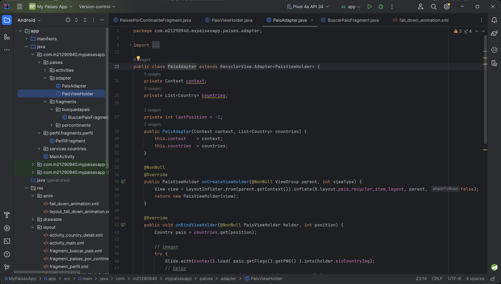
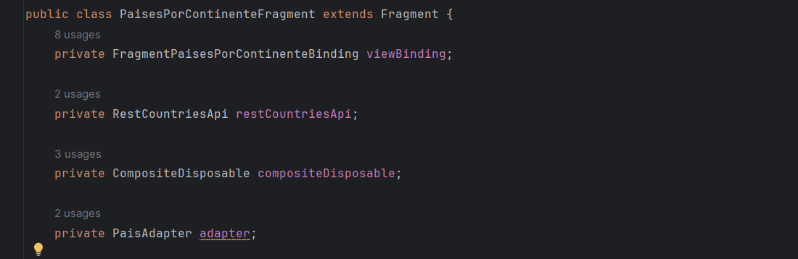
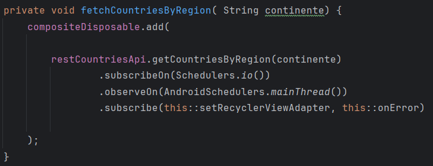
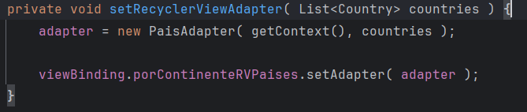
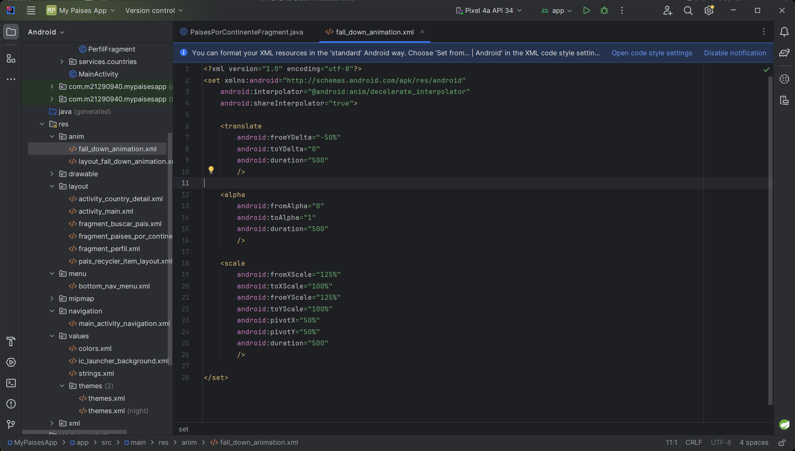
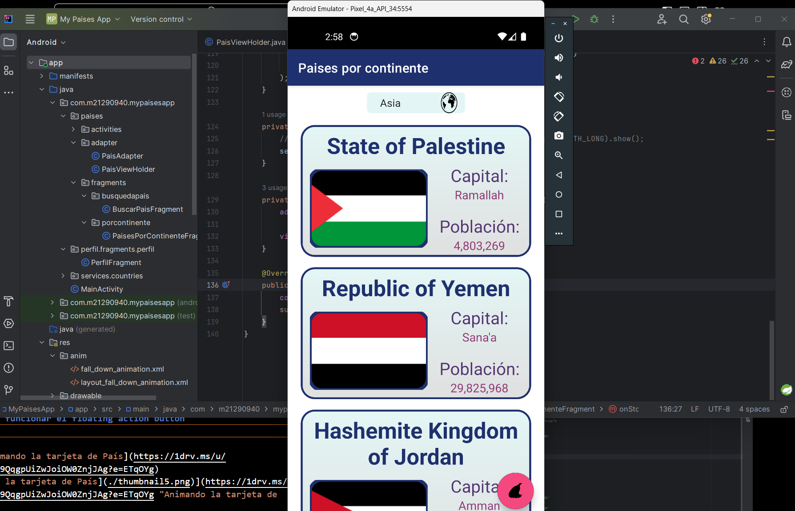

# Haciendo funcionar el fragment de Continentes

Implementando el servicio de RestCountries para obtener infromación de paises por continente

## Preparando el Adaptador para  el RecyclerView

### Video
> [S7 - Creando clases PaisViewHolder y PaisAdapter](https://1drv.ms/u/s!AvB-2ztiY9QqgpUr2KS0jUANzj8iYQ?e=XcTRc0)
[](https://1drv.ms/u/s!AvB-2ztiY9QqgpUr2KS0jUANzj8iYQ?e=XcTRc0 "Creando clases PaisViewHolder y PaisAdapter")

## Creando los objetos necesarios para trabajar

### Video
> [S7 - Definición de objetos e inicialización](https://1drv.ms/u/s!AvB-2ztiY9QqgpUs170LLfwuN6b-oQ?e=tnz0fh)
[](https://1drv.ms/u/s!AvB-2ztiY9QqgpUs170LLfwuN6b-oQ?e=tnz0fh "Definición de objetos e inicialización")

## Solicitando la información a la Api

### Video
> [S7 - Método para traer información de la API](https://1drv.ms/u/s!AvB-2ztiY9QqgpUtbqD38cLrZRerOw?e=nPbbge)
[](https://1drv.ms/u/s!AvB-2ztiY9QqgpUtbqD38cLrZRerOw?e=nPbbge "Método para traer información de la API")

## Mandando la información al RecyclerView

Para hacer esto es neceario un permiso que se tiene que declarar en el archivo "AndroidManifest.xml", el permiso es el siguiente
```xml
    <uses-permission android:name="android.permission.INTERNET" />
```

### Video
> [S7 - Creando el adaptador del RecyclerView y limpiando la basura](https://1drv.ms/u/s!AvB-2ztiY9QqgpUultW_w4JmKrngnA?e=7HxsA0)
[](https://1drv.ms/u/s!AvB-2ztiY9QqgpUultW_w4JmKrngnA?e=7HxsA0 "Creando el adaptador del RecyclerView")


## Añadiendo animación al country_recycler_item_layout
Código de la animación:
```xml
    <translate
        android:fromYDelta="-50%"
        android:toYDelta="0"
        android:duration="500"
        />

    <alpha
        android:fromAlpha="0"
        android:toAlpha="1"
        android:duration="500"
        />

    <scale
        android:fromXScale="125%"
        android:toXScale="100%"
        android:fromYScale="125%"
        android:toYScale="100%"
        android:pivotX="50%"
        android:pivotY="50%"
        android:duration="500"
        />
```

### Video
> [S7 - Animando la tarjeta de País](https://1drv.ms/u/s!AvB-2ztiY9QqgpUwegXKjoMMHSZTcg?e=L3A6L1)
[](https://1drv.ms/u/s!AvB-2ztiY9QqgpUwegXKjoMMHSZTcg?e=L3A6L1 "Animando la tarjeta de País")

## Haciendo funcionar el floating action button

### Video
> [S7 - Animando la tarjeta de País](https://1drv.ms/u/s!AvB-2ztiY9QqgpUxk7OQO14awQbtkQ?e=4pIPbD)
[](https://1drv.ms/u/s!AvB-2ztiY9QqgpUxk7OQO14awQbtkQ?e=4pIPbD "Animando la tarjeta de País")

