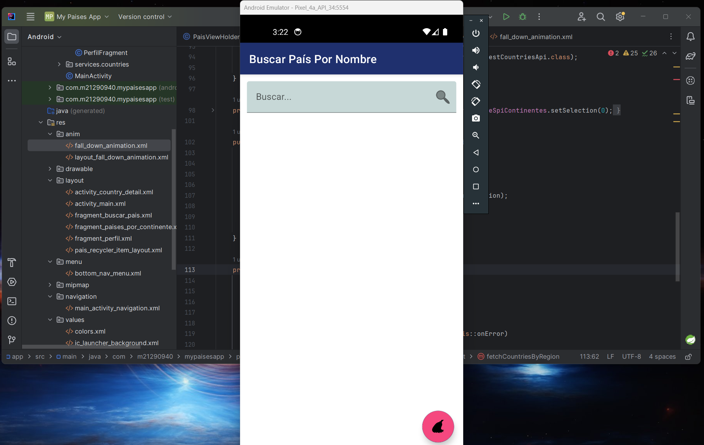

# Haciendo funcionar el fragment de Bucar País

Implementando el servicio de RestCountries para buscar infromación de paises por coincidencia de nombre

## Video
> [S7 - Poniendo a chambear bien al BuscarFragment](https://1drv.ms/u/s!AvB-2ztiY9QqgpU0Scf_DqJ7UOnexg?e=77nLve)

